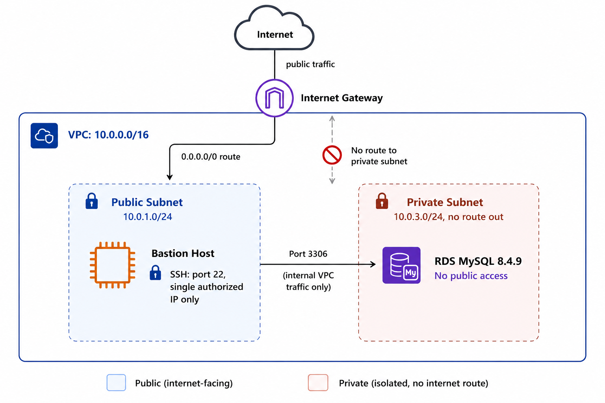

# Architecture

Network and access design for the Data Warehouse RDS instance.

## Overview

The database is not reachable from the internet under any circumstance. Every path to it runs through a single controlled entry point, the bastion host. This document covers the VPC layout, subnet design, security group rules, and the reasoning behind each decision.

## Network Diagram

```
                              Internet
                                 |
                                 v
                        [Internet Gateway]
                                 |
              -------------------------------------
              |                                     |
              v                                     v
     [Public Subnet A]                     [Public Subnet B]
     10.0.1.0/24                           10.0.2.0/24
     Bastion Host (EC2)                    (reserved, unused)
              |
              | port 3306, internal VPC traffic only
              v
     [Private Subnet A]                    [Private Subnet B]
     10.0.3.0/24                           10.0.4.0/24
     RDS Instance (primary)                (reserved for Multi-AZ)
```

Only the bastion host has a public IP. The RDS instance has none.

## VPC

| Attribute | Value |
|---|---|
| Name | `warehouse-vpc` |
| CIDR block | `10.0.0.0/16` |
| Region | us-east-1 |

A `/16` block provides 65,536 addresses, far more than this project needs, but it leaves room to add more subnets later without redesigning the network.

## Subnets

| Name | CIDR | Availability Zone | Type |
|---|---|---|---|
| `public-subnet-1a` | `10.0.1.0/24` | AZ-A | Public |
| `public-subnet-1b` | `10.0.2.0/24` | AZ-B | Public |
| `private-subnet-1a` | `10.0.3.0/24` | AZ-A | Private |
| `private-subnet-1b` | `10.0.4.0/24` | AZ-B | Private |

Two subnets exist per tier because RDS requires a DB Subnet Group spanning at least two availability zones, even for a single-instance deployment. This is a hard requirement from AWS, not an optional best practice, RDS will reject a subnet group with only one AZ represented.

Only `private-subnet-1a` is currently in use by the RDS instance. `private-subnet-1b` exists to satisfy the subnet group requirement and to leave the door open for Multi-AZ failover later, without needing to rebuild the network.

## Routing

**Public route table (`public-rt`)**

| Destination | Target |
|---|---|
| `10.0.0.0/16` | local |
| `0.0.0.0/0` | Internet Gateway |

Associated with both public subnets. This is what makes a subnet "public", not the subnet itself, but the fact that its route table sends internet-bound traffic to an Internet Gateway.

**Private subnets**

No custom route table was created. They use the VPC's default, which only contains the local route (`10.0.0.0/16` stays inside the VPC). No route to `0.0.0.0/0` exists anywhere in this table. This is what makes the private subnets actually private, there is no path out to the internet, and therefore no path in either.

## Why no NAT Gateway

A NAT Gateway lets private resources initiate outbound connections to the internet while remaining unreachable from it. This project has no such requirement: the RDS instance never needs to call an external service, download a package, or reach anything outside the VPC. Its only communication partner is the bastion host, which is internal VPC traffic and does not require internet routing at all.

Adding a NAT Gateway here would introduce an unused, billed resource (approximately $0.045/hour plus data processing charges) with no functional benefit. It was deliberately left out.

## Security Groups

**`bastion-sg`** (attached to the bastion host)

| Direction | Protocol | Port | Source/Destination | Purpose |
|---|---|---|---|---|
| Inbound | TCP | 22 | Single authorized IP (`/32`) | SSH access, restricted to one known IP, not open ranges |
| Outbound | All | All | `0.0.0.0/0` | Default, allows the bastion to reach RDS and install packages |

**`rds-interns-sg`** (attached to the RDS instance)

| Direction | Protocol | Port | Source/Destination | Purpose |
|---|---|---|---|---|
| Inbound | TCP | 3306 | `bastion-sg` (security group reference, not an IP) | Only the bastion can reach the database |
| Outbound | All | All | `0.0.0.0/0` | Default |

The RDS inbound rule references the bastion's security group ID rather than its IP address. This is deliberate. An IP-based rule breaks if the bastion is ever replaced or relaunched with a new address. A security-group-based rule keeps working automatically as long as the new resource is placed in the same security group, no manual update required.

## RDS Configuration

| Setting | Value |
|---|---|
| Engine | MySQL 8.4.9 |
| Instance class | db.t4g.micro |
| Storage | 20 GB, General Purpose SSD (gp2) |
| Public accessibility | Disabled |
| Subnet group | `warehouse-db-subnet-group` (private-subnet-1a, private-subnet-1b) |
| Security group | `rds-interns-sg` |

With Public Accessibility set to Disabled, AWS does not assign a public IP or a public DNS resolution path to the instance. Even if someone had the endpoint hostname, there is nothing on the public internet for it to resolve to.

## Access Path

There is exactly one way to reach the database:

1. SSH into the bastion host, authenticated by a private key and restricted to one IP address
2. From inside the bastion, connect to the RDS endpoint on port 3306 using the MySQL client
3. The security group allows this specific hop because it explicitly trusts the bastion's security group, nothing else

No direct connection from a local machine to RDS is possible, by design. This forces every connection, human or automated, through a single auditable checkpoint.

## Design Decisions Log

| Decision | Reasoning |
|---|---|
| Custom VPC instead of default VPC | Full control over which subnets are public versus private; default VPC subnets are public by default, requiring extra work to lock down |
| Two AZs for private subnets | Required by RDS for the DB Subnet Group, and leaves Multi-AZ as a future option without rework |
| No NAT Gateway | Private subnet has no outbound internet requirement; avoids an unnecessary hourly charge |
| Security-group-based source rule instead of IP-based | Survives bastion replacement without manual security group edits |
| Public access disabled on RDS | Removes the database from the public internet entirely, not just firewalled, actually unreachable |

## Known Setup Issue

During initial provisioning, the bastion host was mistakenly launched into a private subnet. This caused all SSH connection attempts to time out, since a private subnet has no route to an Internet Gateway and the instance received no public IP. The fix was to relaunch the bastion in `public-subnet-1a` with auto-assign public IP enabled. This is recorded here as a reminder that subnet placement, not just security group rules, determines reachability.